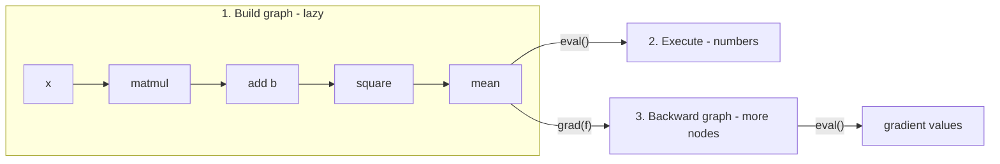

# 00 - Introduction & Philosophy

> Reading companion for an educational autograd engine. Read these guides in
> order; each maps onto one module in `src/vjpflow/` and one or more
> derivations in `notes/`.

## What you will build

A working automatic-differentiation engine that can run a GPT-2 forward and
backward pass, in ~1000 lines of heavily-commented Python. By the end you will
understand, from first principles:

- how a framework turns `a + b` into a *graph* instead of a number;
- how `grad(f)` mechanically produces the backward pass from the forward pass;
- how the same program runs on a CPU (numpy) or an Apple GPU (hand-written
  Metal kernels);
- what `torch.compile` / `jax.jit` / MLX's lazy mode actually do under the hood.

This is a *learning* engine. It omits the engineering that makes a real
framework fast and robust (memory pools, dtype promotion, op scheduling, fused
backward kernels) so that the *ideas* stay visible. Where we cut a corner, a
comment says so.

## The one big idea: a program is a graph

When you write

```python
y = (x @ W + b)
loss = (y * y).mean()
```

in PyTorch's eager mode, each line runs immediately and also records a node in a
hidden graph so that `.backward()` can later walk it. In MLX or JAX, *nothing*
runs on those lines at all -- they only build the graph; computation is deferred
until you ask for a value. Both styles share the same insight:

> **Differentiable programming = building a data structure (the computation
> graph) and then transforming it** (evaluate it forward; or differentiate it to
> get a backward graph).

We adopt the **lazy** style (like MLX/JAX), because it makes that insight
literal: the graph is a first-class object you can inspect, rewrite, and
differentiate before any number is computed.



## Two design decisions, made explicit

This project deliberately takes the more infrastructure-oriented fork at two
forks in the road. If you are aiming at ML-systems / optimization work, these
are the interesting ones.

### Eager vs lazy execution -> **lazy**

| | Eager (PyTorch) | Lazy (MLX / JAX / this repo) |
|---|---|---|
| When does `a+b` run? | Immediately | When you call `eval()` |
| Graph visible before run? | Only internally, for backward | Yes -- it *is* the program |
| Easiest to debug? | Eager (print any value) | Lazy (must force eval) |
| Enables fusion / compilation? | Needs a tracer (`torch.compile`) | Naturally (the graph is already there) |

We pay a small debuggability cost for a big conceptual win: differentiation and
JIT become *graph transformations*, which is exactly how production compilers
(XLA) think.

### Object-oriented `.backward()` vs functional `grad(f)` -> **functional**

We do not attach `.grad` to tensors. Instead, `grad` is a **transform**:
`grad(f)` returns a new function that computes derivatives of `f`. This is the
JAX/MLX model. It has one delightful consequence: because the backward pass is
*built from the same primitives as the forward pass*, `grad(grad(f))` (second
derivatives) works with no extra code. See [04](04-functional-autodiff.md).

## Map of the codebase

| Module | Guide | Role |
|---|---|---|
| `src/vjpflow/tensor.py` | [02](02-tensors-and-the-lazy-graph.md) | the lazy graph node |
| `src/vjpflow/graph.py` | [02](02-tensors-and-the-lazy-graph.md) | topo sort + evaluation |
| `src/vjpflow/primitives.py` | [03](03-primitives-and-vjp.md) | the ~20 ops (forward + vjp) |
| `src/vjpflow/autodiff.py` | [04](04-functional-autodiff.md) | `grad` / `value_and_grad` |
| `src/vjpflow/backends/numpy_backend.py` | [05](05-numpy-backend.md) | CPU reference |
| `src/vjpflow/backends/metal_backend.py` | [06](06-intro-to-metal.md), [07](07-raw-metal-backend-pyobjc.md) | Apple GPU |
| `src/vjpflow/nn/functional.py` | [08](08-building-layers.md) | layers |
| `src/vjpflow/models/gpt2.py` | [09](09-capstone-gpt2.md) | capstone |
| `src/vjpflow/jit.py` | [10](10-jit-and-fusion.md) | compile + fusion |
| `notes/` (Obsidian vault) | [11](11-guided-exercises.md) | the math |

## How to read

1. Skim this page and [01](01-environment-setup.md), get the tests passing.
2. Read [02](02-tensors-and-the-lazy-graph.md) -> [04](04-functional-autodiff.md)
   in order with the source open beside you. These three are the core.
3. Detour into [05](05-numpy-backend.md)-[07](07-raw-metal-backend-pyobjc.md) for
   the hardware story.
4. [08](08-building-layers.md) and [09](09-capstone-gpt2.md) connect every
   `notes/` derivation to runnable code.
5. [10](10-jit-and-fusion.md) and [11](11-guided-exercises.md) are the
   "now go further" chapters.

> [!tip]
> The fastest way to trust an autograd engine is the **finite-difference
> gradient check** in `tests/util.py`. Keep it in mind from the start: if your
> analytic gradient matches a numerical perturbation, it is almost certainly
> correct.
