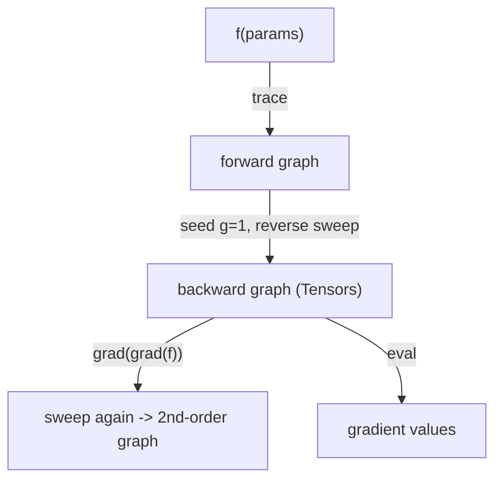

# 04 - Functional Autodiff: `grad` and `value_and_grad`

**Code:** `src/vjpflow/autodiff.py`

This is the chapter where it all comes together. We have lazy nodes
([02](02-tensors-and-the-lazy-graph.md)) and local gradient rules
([03](03-primitives-and-vjp.md)). Now we assemble them into a full reverse-mode
backward pass -- expressed as a **function transform**, the JAX/MLX way.

## Theory: reverse-mode AD in four steps

Given `f: inputs -> scalar`, `grad(f)` returns a function computing `df/d(inputs)`.
The algorithm:

1. **Trace.** Run `f` on the inputs. Because ops are lazy, this builds the
   forward graph and computes nothing.
2. **Seed.** Set the output's cotangent to `1` (we use `ones_like(output)`).
3. **Sweep backward.** Visit nodes in **reverse topological order**. For each,
   call its `vjp` to convert the node's cotangent into cotangents for its
   inputs, and **accumulate** (add) them.
4. **Read off.** The accumulated cotangents of the requested arguments are the
   gradients.

Why *reverse* order? A node's cotangent is only complete once *every* consumer
has contributed. Processing consumers before producers guarantees that.

Why *accumulate*? If a tensor `x` is used in two places, `dL/dx` is the **sum**
of the contributions along each path -- the multivariate chain rule. Forgetting
to add (overwriting instead) is the classic autograd bug; the test
`test_gradient_accumulation_on_shared_node` guards against it.

## The core sweep

```python
def _compute_cotangents(output, wanted):
    cotangents = {id(output): ones_like(output)}      # 2. seed
    for node in reversed(_reverse_topo(output)):      # 3. reverse order
        g = cotangents.get(id(node))
        if g is None or node.op is None:
            continue                                  # unreached, or a leaf
        input_grads = node.op.vjp(g, node, *node.inputs)
        for inp, ig in zip(node.inputs, input_grads, strict=True):
            if ig is None:
                continue                              # non-differentiable input
            existing = cotangents.get(id(inp))
            cotangents[id(inp)] = ig if existing is None else add(existing, ig)
    return [cotangents.get(id(t)) or zeros_like(t) for t in wanted]
```

Everything `vjp` produces is an ordinary `Tensor`. So **the backward pass is
itself a lazy graph** -- which is the secret to higher-order gradients (see
below). An argument that `f` never used gets `zeros_like` (test:
`test_unused_argument_gets_zero_grad`).

## The transforms

`value_and_grad(f, argnums)` returns `(value, grads)`; `grad(f, argnums)` returns
just `grads`. `argnums` is an int (one argument -> one gradient) or a tuple
(several -> a tuple of gradients).

```python
def value_and_grad(fn, argnums=0):
    indices, single = _normalise_argnums(argnums)
    def wrapped(*args, **kwargs):
        value = fn(*args, **kwargs)                  # 1. trace
        grads = _compute_cotangents(value, [args[i] for i in indices])
        value.eval(); [g.eval() for g in grads]      # force concrete results
        return value, (grads[0] if single else tuple(grads))
    return wrapped
```

Note we only `eval` at the very end. All of forward and backward is built as
graph first, then executed once -- the lazy discipline pays off here.

## Why functional matters

Compare the ergonomics:

```python
# PyTorch (object-oriented, mutating):
loss = f(x); loss.backward(); g = x.grad

# here / JAX / MLX (functional, pure):
g = grad(f)(x)
```

No global state, no `.grad` to zero between steps, no accidental gradient
accumulation across iterations. The transform takes a function and returns a
function. This composes:

```python
# second derivative of x^3 is 6x -- and it just works
d1 = lambda x: grad(lambda x: (x*x*x).sum())(x).sum()
d2 = grad(d1)            # grad of a grad
```

`d2` differentiates a function that *already contains a backward pass*. Because
that backward pass is built from the same primitives (each with its own `vjp`),
the engine differentiates it like any other graph. This is
`test_second_order_gradient`. Try writing that in a hand-rolled `.backward()`
engine -- you cannot, without rebuilding it as a graph, which is what we did.



## Differentiating a dict of parameters

`value_and_grad` differentiates *positional* arguments. Real models keep
parameters in a dict. The capstone shows the standard trick -- flatten to a list,
differentiate w.r.t. all of them, re-key (`models/gpt2.py:value_and_grad_params`).
JAX automates this with "pytrees"; we keep it explicit so the mechanism is
visible.

## Design patterns in this chapter

- **Function transform** (`grad : (a->b) -> (a->b')`), the functional-programming
  view of differentiation.
- **Reverse-mode accumulation** over a topologically-sorted graph.
- **Closure capture** of the trace inside the returned function.
- **Composable transforms** giving higher-order derivatives for free.

## What's next

The engine is complete and backend-agnostic. Now we look at where the numbers
actually live: [05 - The numpy backend](05-numpy-backend.md), then the GPU.
