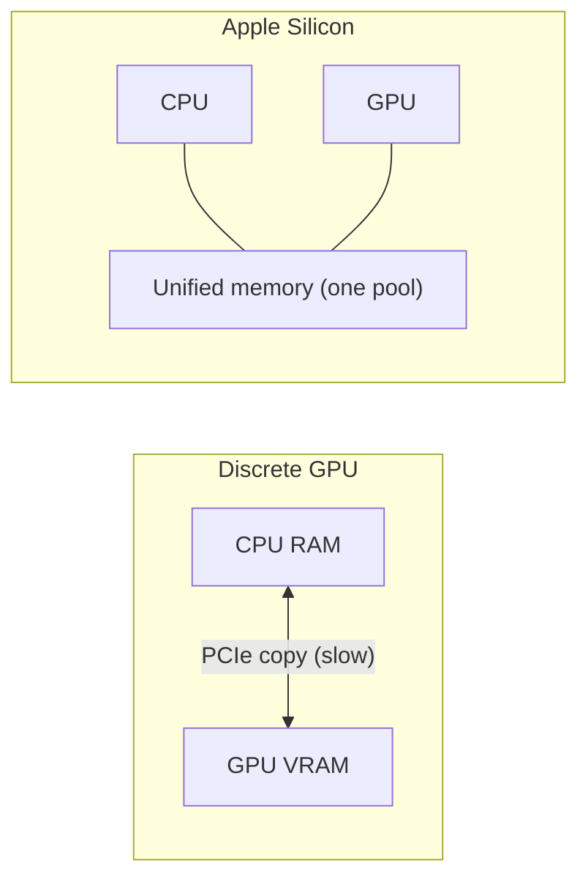
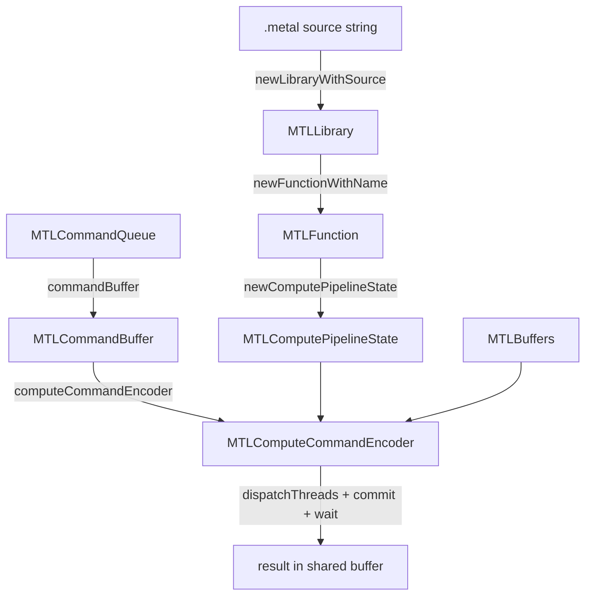

# 06 - Introduction to Metal & Apple Silicon

No prior GPU or Metal experience assumed. This chapter builds the mental model;
[07](07-raw-metal-backend-pyobjc.md) writes the code. If you only ever use the
numpy backend, you can skip both -- but the payoff here is understanding *why*
MLX is fast on a Mac and what "running on the GPU" actually entails.

## Why a GPU at all

A CPU has a handful of powerful cores optimized for latency (finish one task
fast). A GPU has thousands of small cores optimized for throughput (finish a
million identical tasks at once). Neural networks are mostly the same operation
applied to every element of a big array -- matmuls, elementwise activations. That
is the GPU's sweet spot: **single instruction, many data (SIMD)**.

**Metal** is Apple's low-level API for talking to the GPU (the counterpart to
CUDA on NVIDIA or Vulkan cross-platform). You write small programs called
*kernels* in the **Metal Shading Language (MSL**, a C++ dialect), and Metal runs
each kernel across a grid of threads on the GPU.

## Apple Silicon's superpower: unified memory

On a discrete-GPU machine (a desktop with an NVIDIA card), CPU and GPU have
*separate* memory. Every input must be copied across the PCIe bus to the GPU and
results copied back -- often the dominant cost.

Apple Silicon (M1/M2/M3...) has **unified memory**: the CPU and GPU share the
same physical RAM. A buffer allocated with `MTLResourceStorageModeShared` is
visible to both with no copy. "Upload" and "download" become pointer reads.



This is *the* reason a from-scratch GPU backend is approachable on a Mac, and a
big part of why MLX exists and performs well there.

## The Metal object model

Running a kernel involves a small cast of objects. You meet all of them in
`metal_backend.py`; here is what each is for.

| Object | What it is | Lifetime |
|---|---|---|
| `MTLDevice` | the GPU itself | one per process |
| `MTLLibrary` | a bundle of compiled kernels | built once from `.metal` source |
| `MTLFunction` | one kernel inside the library | looked up by name |
| `MTLComputePipelineState` | a function compiled into a runnable pipeline | cached per function |
| `MTLCommandQueue` | an ordered channel for submitting work | one per process |
| `MTLCommandBuffer` | a batch of GPU commands | one per dispatch |
| `MTLComputeCommandEncoder` | records "run this kernel on these buffers" | one per dispatch |
| `MTLBuffer` | a chunk of (shared) memory | per array |

The flow for one operation:



The library/pipeline/queue are built **once** at startup; only the command
buffer + encoder are per-dispatch.

## Threads, threadgroups, and the grid

When you dispatch a kernel you launch a **grid** of threads -- one per output
element, typically. The grid is divided into **threadgroups** (Metal's name for
CUDA "blocks"); threads in a group can share fast memory and synchronize.

Inside the kernel, each thread asks "which element am I?" via a special argument:

```metal
kernel void ew_add(device const float* a [[buffer(0)]],
                   device const float* b [[buffer(1)]],
                   device float* out      [[buffer(2)]],
                   constant uint& count   [[buffer(3)]],
                   uint gid [[thread_position_in_grid]]) {
    if (gid >= count) return;   // grid is rounded up; guard the tail
    out[gid] = a[gid] + b[gid];
}
```

- `[[buffer(n)]]` binds an argument to the n-th buffer the host set.
- `[[thread_position_in_grid]]` gives this thread's global index `gid`.
- The bounds check handles the grid being rounded up to a whole number of
  threadgroups.

That is the entire idea: **write the body for one element; the GPU runs it for
all of them in parallel.**

## What you need installed

- An Apple Silicon Mac (the kernels assume the Apple GPU; Intel Macs with AMD
  GPUs may work but are untested).
- `pyobjc-framework-Metal` (`uv sync --extra metal`) -- Python bindings to the
  Metal runtime. No Xcode app required.
- Xcode **Command Line Tools** (`xcode-select --install`) provide the Metal
  compiler used when we build the library from source at runtime.

Verify: `uv run python -c "from vjpflow.backends.metal_backend import MetalBackend; print(MetalBackend.is_available())"` should print `True`.

## Scope of our backend (important expectation-setting)

We implement *core subset* kernels: matmul, elementwise, and last-axis
reductions -- enough to run a small MLP + softmax forward entirely on the GPU.
Index/shape ops (`gather`, `concat`, `transpose`, ...) fall back to numpy. The
kernels are **naive** (one thread per output, no tiling): the goal is to show the
pipeline clearly, not to beat Apple's MPS. GPT-2 still runs on numpy.

## What's next

[07 - Raw Metal Backend with PyObjC](07-raw-metal-backend-pyobjc.md) maps every
object above onto real code in `metal_backend.py` and `kernels.metal`.
