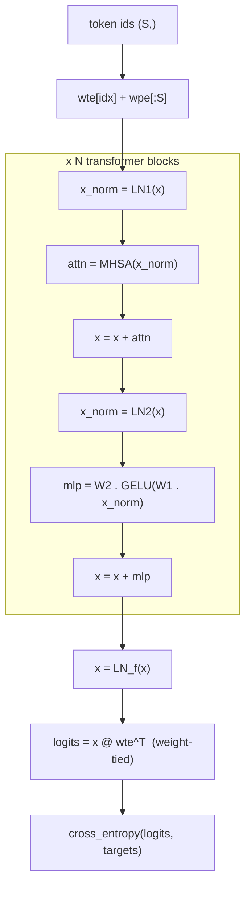

# 09 - Capstone: GPT-2, Forward and Backward

**Code:** `src/vjpflow/models/gpt2.py` -- **Math:** `notes/GPT-2 Back Propagation.md`

Everything converges here. We assemble the layers from
[08](08-building-layers.md) into a complete GPT-2, run a forward pass, and -- with
a single `value_and_grad` call -- get gradients for *every* parameter. The
backward derivation that fills the multi-section `notes/GPT-2 Back Propagation.md`
is executed for us; this file contains **zero** lines of backward code.

## Architecture (pre-LayerNorm GPT-2)



This is the exact structure of section 2 of the note.

## Parameters as a dict (the functional style)

`init_params` returns a plain `dict[str, Tensor]` of leaf tensors -- token/position
embeddings, per-block LayerNorm gains/biases, fused QKV and output projections,
and the MLP weights, plus a final LayerNorm. There is no `nn.Module`, no hidden
state. The model is a pure function `params -> logits`. This mirrors how
JAX/Flax separate parameters from computation, and it makes the `grad` transform
trivial to apply.

## Forward

```python
def forward(params, idx, config):
    tok = F.embedding(params["wte"], idx)          # (S, d)
    pos = P.slice_(params["wpe"], 0, S, axis=0)     # (S, d)  first S positions
    x = tok + pos
    for i in range(config.n_layer):
        x = F.residual(x, F.attention(F.layernorm(x, g1, b1), ...))
        x = F.residual(x, mlp(F.layernorm(x, g2, b2)))
    x = F.layernorm(x, params["lnf_g"], params["lnf_b"])
    return P.matmul(x, params["wte"].T)            # weight-tied LM head
```

### Weight tying -- read this carefully

The LM head reuses the token-embedding matrix: `logits = X @ wte^T`. So `wte`
appears in *two* places: the embedding lookup at the bottom and the head at the
top. The note (section 5.2/5.8) shows its gradient must accumulate both
contributions: `G_wte = G_wte^(head) + G_wte^(embed)`.

We get this **for free**. Both uses point at the *same leaf tensor object*. When
the backward sweep ([04](04-functional-autodiff.md)) reaches `wte` along two
different paths, it *adds* the cotangents -- exactly the accumulation the note
prescribes. No special-casing.

## Backward: one call

```python
def value_and_grad_params(params, idx, targets, config):
    names = list(params)
    def flat_loss(*values):
        return loss(dict(zip(names, values)), idx, targets, config)
    value, grads = value_and_grad(flat_loss, argnums=tuple(range(len(names))))(*[params[n] for n in names])
    return value, dict(zip(names, grads))
```

`value_and_grad` differentiates positional arguments, so we flatten the dict to a
list, differentiate w.r.t. all of them, and re-key. (JAX automates this with
pytrees; we keep it explicit so the mechanism is visible.) One call traces the
forward graph, builds the backward graph, and evaluates both.

## A training step

```python
def sgd_step(params, grads, lr):
    return {name: (w - lr * grads[name]).detach() for name, w in params.items()}
```

`detach()` turns the updated value into a fresh leaf, so the next step does not
build a graph reaching back through the entire optimization history (which would
leak memory and recompute the past). This is the lazy-engine analogue of
PyTorch's `with torch.no_grad()` parameter update.

## See it learn

`tests/test_gpt2.py` and this snippet overfit a single sequence:

```python
cfg = gpt2.GPT2Config(vocab_size=16, block_size=8, n_layer=2, n_head=2, n_embd=16)
params = gpt2.init_params(cfg, seed=1)
idx = np.array([1,2,3,4,5,6,7,0]); tgt = np.array([2,3,4,5,6,7,0,1])
for _ in range(40):
    L, grads = gpt2.value_and_grad_params(params, idx, tgt, cfg)
    params = gpt2.sgd_step(params, grads, lr=0.5)
# loss falls from ~ln(16)=2.77 to ~0.04
```

The initial loss is `~ln(vocab)` (a uniform guess), and it drops sharply -- proof
the end-to-end gradient is correct. `test_gpt2_parameter_gradients_match_numeric`
additionally finite-difference-checks the weight-tied `wte` and a block LayerNorm
gain.

## Observability tips (LLM-engineering habit)

When a model misbehaves, instrument *before* you guess:

- **Initial loss sanity:** untrained CE should be `~ln(V)`. Far off -> a bug in the
  loss, the head, or init.
- **Gradient norms per parameter:** `np.linalg.norm(g.numpy())`. A norm that is
  zero (dead path) or exploding localizes the problem fast.
- **Finite-difference spot checks** (`tests/util.check_grad`) on any layer you
  suspect.

## Design patterns in this chapter

- **Params/computation separation** (functional model), enabling `grad`.
- **Weight tying via shared graph nodes**, with gradient accumulation handled by
  the engine.
- **Cut-the-graph on update** (`detach`) to bound memory across steps.

## What's next

The lazy graph we built lets us do something eager engines cannot do easily:
rewrite the program before running it. That is
[10 - JIT & Fusion](10-jit-and-fusion.md).
