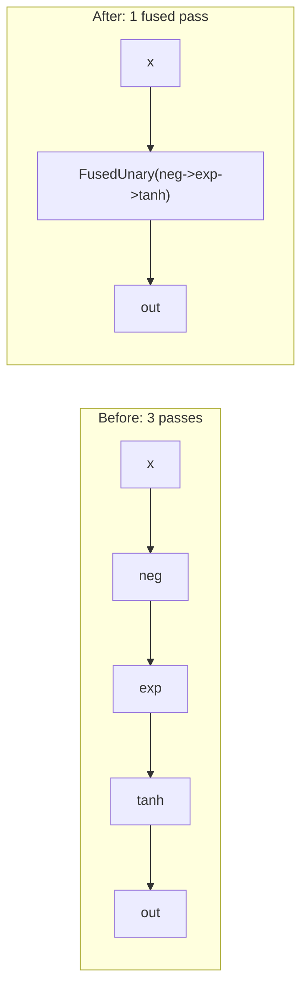

# 10 - JIT & Kernel Fusion

**Code:** `src/vjpflow/jit.py`

This chapter cashes in the lazy design. Because the computation graph exists as
*data* before anything runs, we can **rewrite it to run faster** -- the entire
reason `jax.jit`, `torch.compile`, MLX's `compile`, and XLA exist. We build a
teaching-sized version: trace once, then fuse elementwise chains.

> This is not a real compiler. It demonstrates one optimization clearly. The
> fused node optimizes the *forward* (inference) graph; gradients are taken on
> the original unfused graph.

## Theory: why fusion is a win

Consider `tanh(exp(neg(x)))`. Run eagerly, that is three passes over the data:
read `x`, write `t1`; read `t1`, write `t2`; read `t2`, write `t3`. Each pass
moves the whole array through memory, and memory bandwidth -- not arithmetic -- is
usually the bottleneck for elementwise ops.

**Fusion** merges the chain into a single pass: for each element, compute
`tanh(exp(-x))` in registers and write once. Three kernel launches and three
memory round-trips become one. At scale this is a large speedup, and it is the
bread-and-butter of `torch.compile`/XLA.



## Tracing and caching

```python
class Compiled:
    def __call__(self, *args):
        out = self._fn(*args)                  # trace: build the forward graph
        out, stats = fuse_elementwise(out)     # rewrite it
        self.last_stats = stats
        return out

def jit(fn): return Compiled(fn)
```

`jit(f)` returns a wrapper that, on each call, traces `f` to a graph and applies
the fusion pass, caching stats per input-shape signature -- the same
shape-specialization `jax.jit` does (a new shape triggers a re-trace).

## The fusion pass

`fuse_elementwise(output)` is a standard **bottom-up graph rewrite with
memoization**: visit nodes inputs-first; whenever a fusible unary op feeds *only*
into another fusible unary op, splice them into one `FusedUnary` node.

```python
class FusedUnary(Primitive):
    def __init__(self, funcs): self.funcs = funcs   # e.g. [Neg, Exp, Tanh]
    def forward(self, backend, x):
        for fn in self.funcs:
            x = fn.forward(backend, x)              # one sweep, no intermediate nodes
        return x
```

Two correctness rules the pass must respect:

1. **Only fusible ops.** We fuse the shape-preserving unary elementwise ops
   (`neg, exp, log, sqrt, tanh`). Reductions, matmul, and reshapes change shape
   or mix elements -- not fusible this way.
2. **Single consumer only.** A node may be fused into its consumer only if it has
   *no other* consumers (`counts[parent] == 1`). If an intermediate is used in
   two places, its value is genuinely needed and must stay materialized.
   `test_no_fusion_across_multi_consumer` guards this.

## Watch it work

```python
from vjpflow.jit import fuse_elementwise
out = P.tanh(P.exp(P.neg(P.sqrt(P.exp(x * x)))))
fused, stats = fuse_elementwise(out)
print(stats.nodes_before, "->", stats.nodes_after)   # 6 -> 2
print(np.allclose(out.numpy(), fused.numpy()))       # True
```

Six op-nodes (`mul`, then five unary) collapse to two: the `mul` (binary, not
fusible) plus one `FusedUnary` of the five-op chain. Values are identical
(`test_fusion_preserves_values`).

## How this maps to the real world

| This repo | Production analogue |
|---|---|
| lazy graph | MLX lazy arrays / JAX jaxprs / FX graphs |
| `jit` trace + shape cache | `jax.jit`, `torch.compile` guards |
| `fuse_elementwise` | XLA fusion, `torch.compile` inductor fusions |
| `FusedUnary.forward` | a generated fused kernel |

A production system also fuses the **backward** graph, fuses across reductions
(e.g. softmax in one pass), tiles matmuls, and picks layouts. Those are the
problems an ML-optimization engineer works on -- and you now have a working,
inspectable model of the substrate they operate on.

## Design patterns in this chapter

- **IR rewrite pass**: transform the graph before execution.
- **Trace + shape-specialized cache** (the JIT contract).
- **Conservative legality checks** (fusibility, single-consumer) to preserve
  semantics.

## What's next

Extend the engine yourself: [11 - Guided Exercises](11-guided-exercises.md).
